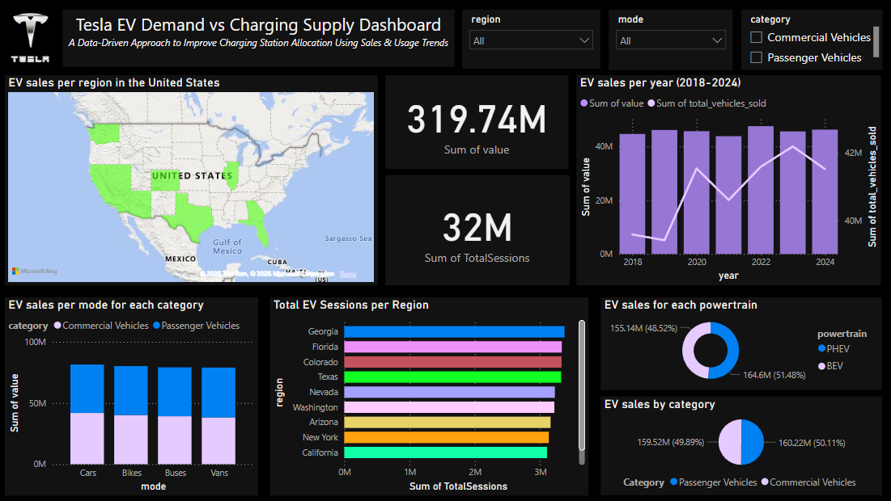

# ⚡ Tesla's EV Charging Network Optimization

<p align="center">
  
</p>

This project aims to optimize the placement and efficiency of Tesla’s EV charging stations by analyzing sales trends, station usage, and regional demand using business intelligence tools such as Power BI, Python, and Streamlit.

---

## 🧠 Objectives

- Analyze Tesla EV sales growth by region and year  
- Identify stations with long wait times or high load  
- Compare regional EV demand to infrastructure  
- Build an interactive dashboard using Power BI  
- Deploy frontend using Streamlit

---

## 🔧 Tools & Technologies

- **Python** (pandas, seaborn, plotly) for EDA  
- **Power BI** for dashboard creation  
- **Streamlit** for interactive frontend  
- **Jupyter Notebook** for data processing

---

## 🔍 Data Preprocessing

Performed cleaning and transformation steps:

- Filtered only `EV Sales` from master data  
- Converted wait time strings to numeric format  
- Merged datasets using `region`  
- Handled missing values and duplicate entries  
- Grouped values for station sessions and sales trends

---

## 📊 Power BI Dashboard Features

<p align="center">
  
</p>

- **Filled Map** – EV sales vs station count by region  
- **KPI Cards** – Total EVs, avg wait time, total sessions  
- **Bar Charts** – Station-level load analysis  
- **Line Charts** – Yearly sales growth  
- **Slicers** – Region, Year, Mode, Powertrain  

▶️ Hosted via Power BI and embedded in Streamlit app

---

## 🌐 Streamlit App

The `app.py` file builds a modern dark-themed frontend with:

- Sidebar navigation  
- Embedded Power BI dashboard  
- Recreated visuals using Plotly  
- Embedded EDA notebook (HTML)  
- Insight-driven questions with interactive charts

To run locally:

```bash
streamlit run app.py
```
